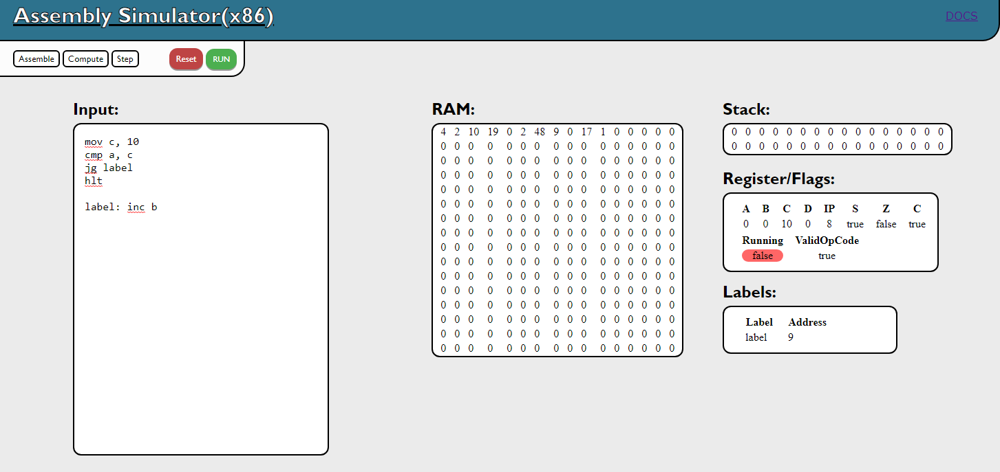
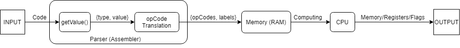

# <u>**EMU8086** Clone</u>

The purpose of this project is to create a handmade 8-bit emulator of a limited instruction set using pure JavaScript.

## **<u>Components</u>**

### CPU Emulator
- General Registers (A, B, C, D)
- Instruction Pointer
- Flags (Sign, Zero, Carry)
---
### Memory
- RAM (256 bits)
- Stack (32 bits)
---
### Assembler
- Parser
---
### UI (Web App)
- Code Editor (Input)
- Registers table 
- RAM table
- Stack table
- Sequentially execution

 
<!--  -->

 

## **<u>How it works</u>**

1) Parsing the code lines using Regex.
2) The code is divided into categories: **Register** / **Number** / **Label**.
3) For each category the text is translated into a structure: {type,value} where type can be *register* / *regaddress* / *address* / *number* in order to map the instructions into opCodes.
4) The code is translated into Machine code and is written in RAM.
5) The CPU reads the memory and executes each opCode.

 

 

## **<u>opCodes</u>**

|Math|Memory|Logic|Test|Jumps|System|
|----|------|-----|----|-----|------|
|ADD |MOV   |AND  |CMP |JMP  |HLT   |
|SUB |PUSH  |OR   |    |JG   |      |
|INC |POP   |SHR  |    |JGE  |      |
|DEC |      |SHL  |    |JL   |      |
|DIV |      |NOT  |    |JLE  |      |
|MUL |      |     |    |JCXZ |      |
|    |      |     |    |JE   |      |
|    |      |     |    |JNE  |      |
|    |      |     |    |LOOP |      |

## **<u>Demo</u>**
https://liviu2299.github.io/EMU8086-Clone/

